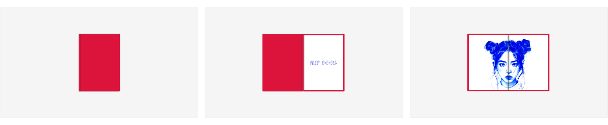

# Web - Flip Book

## 🔖 Table of contents

<details>
        <summary>
		CLICK TO ENLARGE 😇
        </summary>
	    📝 <a href="#description">Description</a>
        <br>
        🔨 <a href="#tech-stack">Tech stack</a>
        <br>
        📂 <a href="#files-description">Files description</a>
        <br>
        💻 <a href="#installation">Installation</a>
        <br>
        🔧 <a href="#whats-next">What's next ?</a>
        <br>
        ♥️ <a href="#thanks">Thanks</a>
        <br>
        👷 <a href="#authors">Authors</a>
</details>

## 📝 <span id="description">Description</span>

This project is a simple flip book designed in HTML and CSS to display a series of pages in a format reminiscent of a book.
<br>
It provides a visually appealing method to navigate through content by flipping the pages.
<br>
A personal challenge for me was to create this book using only HTML and CSS.
<br>
However, I intend to make the whole flip book dynamic with JavaScript in the future.

## 🔨 <span id="tech-stack">Tech stack</span>

<p align="left">
    
    
    
<p>

## 📂 <span id="files-description">Files description</span>

| FILE             | DESCRIPTION                                         |
| :--------------: | --------------------------------------------------- |
| `images`         | Containing images used in the project.              |
| `resources`      | Contains additional materials for the README file.  |
| `flip_book.html` | Main HTML file for the flip book.                   |
| `README.md`      | The readme file you are currently reading ;).       |
| `style.css`      | CSS stylesheet for the flip book layout.            |

## 💻 <span id="installation">Installation</span>

1. Clone this repository:
    - Open your preferred Terminal.
    - Navigate to the directory where you want to clone the repository.
    - Run the following command:
```
git clone https://github.com/fchavonet/web-flip_book.git
```

2. Open the `flip_book.html` file in a web browser.

3. Click on the book cover to open it and then navigate between pages by clicking on the front or back page (next or prev).

<p align="center">

</p>

## 🔧 <span id="whats-next">What's next ?</span>

- Implement a dynamic content loading system per page using JavaScript.
- Add a JavaScript function to dynamically create pages based on a variable (number of pages).
- Integrate a color selector for the flipbook cover.

## ♥️ <span id="thanks">Thanks</span>

A big thank you to my friend Yoann for taking time out of his busy schedule to test this little Web App.

## 👷 <span id="authors">Authors</span>

**Fabien CHAVONET**
- Github: [@fchavonet](https://github.com/fchavonet)
