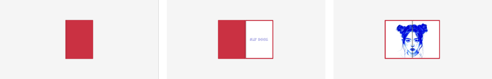

# Flip Book

## 🔖 Table of contents

<details>
        <summary>
        CLICK TO ENLARGE 😇
        </summary>
        📄 <a href="#description">Description</a>
        <br>
        🎓 <a href="#objectives">Objectives</a>
        <br>
        🔨 <a href="#tech-stack">Tech stack</a>
        <br>
        📂 <a href="#files-description">Files description</a>
        <br>
        💻 <a href="#installation_and_how_to_use">Installation and how to use</a>
        <br>
        🔧 <a href="#whats-next">What's next?</a>
        <br>
        ♥️ <a href="#thanks">Thanks</a>
        <br>
        👷 <a href="#authors">Authors</a>
</details>

## 📄 <span id="description">Description</span>

This project is a simple flip book created with HTML and CSS. The design mimics the real-life experience of flipping through the pages of a book. Using CSS for page animations and transitions, the flip book provides a smooth experience for the user, making it both functional and aesthetically pleasing.

## 🎓 <span id="objectives">Objectives</span>

- All pages should flip smoothly using CSS animations.
- The project must be built using only HTML and CSS (at first).
- Improve CSS animation skills by creating realistic page effects.
- Provide clear and concise documentation for the code.

## 🔨 <span id="tech-stack">Tech stack</span>

<p align="left">
    
    
    
    
    
    
    
</p>

## 📂 <span id="files-description">File description</span>

| **FILE**     | **DESCRIPTION**                                     |
| :----------: | --------------------------------------------------- |
| `assets`     | Contains the resources required for the repository. |
| `index.html` | Main HTML structure for the project.                |
| `style.css`  | Styles and animations for the project.              |
| `script.js`  | Behavior script for interactivity.                  |
| `README.md`  | The README file you are currently reading 😉.       |

## 💻 <span id="installation_and_how_to_use">Installation and how to use</span>

**Installation:**

1. Clone this repository:
    - Open your preferred Terminal.
    - Navigate to the directory where you want to clone the repository.
    - Run the following command:

```
git clone https://github.com/fchavonet/web-flip_book.git
```

2. Open the repository you've just cloned.

**How to use:**

1. Open the `index.html` file in your web browser.

2. Interact with the flip book by clicking on the cover or the pages.

You can also test the web application online by clicking [here](https://fchavonet.github.io/web-flip_book/).

<p align="center">
    
</p>

## 🔧 <span id="whats-next">What's next?</span>

- Implement a dynamic content loading system per page using JavaScript.
- Add a JavaScript function to dynamically create pages based on a variable (number of pages).
- Integrate a color selector for the flipbook cover.

## ♥️ <span id="thanks">Thanks</span>

A big thank you to my friends Pierre and Yoann, always available to test and provide feedback on my projects.

## 👷 <span id="authors">Authors</span>

**Fabien CHAVONET**
- Github: [@fchavonet](https://github.com/fchavonet)
